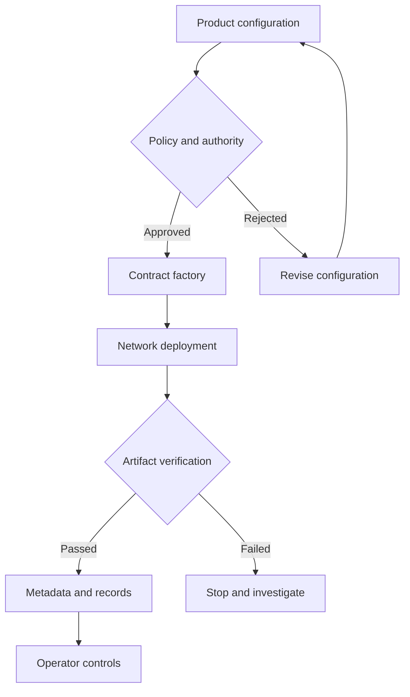

[← All work](https://github.com/J0UH) · [Stablecoin and programmable asset infrastructure](https://github.com/J0UH/stablecoin-infrastructure)

# Programmable asset issuance

A repeatable issuance process for programmable money, commodities, and other tokenised assets.

Issuing a different kind of asset changes the product's meaning, but many of the operational questions remain. Which rules apply? Who can act? What was deployed, and how can someone verify it?

This work turns issuance into a recorded workflow. Product configuration, network execution, metadata, and authority setup need a clear relationship before a release begins.

## Making a launch reproducible

The system covers configuration for different asset types, deployment and verification, role setup, public integration artifacts, and the environments used to support them.

I keep the product definition separate from the act of executing it on a network. That makes it easier to review the intended asset before an operator takes a consequential step.

The result of the workflow needs enough information to explain what happened and what remains. A repeatable process gives the next operator a starting point and makes a later verification less dependent on the person who ran the release.

## What the work covers

- Configurable fiat, commodity, metal, and capital-market assets
- Deployment and verification workflows
- Role and authority setup
- Metadata and public integration artifacts
- Test funding and environment support
- Operator-facing issuance controls

A closer look at the technical flow

## Related work

- [Stablecoin and programmable asset infrastructure](https://github.com/J0UH/stablecoin-infrastructure)
- [Smart contract operations](https://github.com/J0UH/smart-contract-operations)
- [Stablecoin as a service](https://github.com/J0UH/stablecoin-service-platform)

Working on a similar problem? [Tell me what you are building](mailto:ju@jomena.group?subject=Programmable%20asset%20issuance).

*This is a public account of the work. Source code and private operating details are not included in this repository.*
