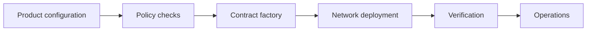

  

# Stablecoin factory

Token issuance becomes a product only when deployment, roles, metadata, verification, and operations can be repeated without improvisation. This system joined the contracts and the operating surface around them.

[Discuss a similar system](mailto:ju@jomena.group?subject=Discuss%20Stablecoin%20factory) | [Book a technical call](mailto:ju@jomena.group?subject=Book%20a%20technical%20call%20about%20Stablecoin%20factory)

## The engineering problem

The factory had to make powerful actions legible and controlled. A deployment should be reproducible. Authority should be explicit. Operators should know what happened, which network it happened on, and what remains to be completed.

## What the system covers

- Configurable token creation
- Deployment and verification workflows
- Role and authority setup
- Metadata and public integration artifacts
- Test funding and environment support
- Operator-facing issuance controls

## System shape

## Build notes

- Turn deployment into a recorded workflow rather than a sequence of terminal commands.
- Separate product configuration from network execution.
- Make authority visible before an operator confirms an irreversible action.

Built under the Aryze umbrella. The underlying source and company IP remain private and owned by Aryze. Delivery involved people across engineering, product, operations, compliance, and design. Open-source foundations retain their original attribution and licences.

## Talk through a similar problem

If you are trying to build, untangle, or ship a system in this area, [send me a note](mailto:ju@jomena.group?subject=I%20need%20help%20with%20Stablecoin%20factory). If the problem needs a deeper technical conversation, [book a call by email](mailto:ju@jomena.group?subject=Book%20a%20technical%20call%20about%20Stablecoin%20factory).
