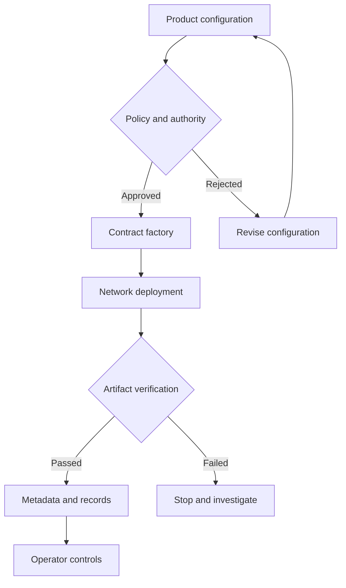

[← All systems](https://github.com/J0UH) · [Stablecoin and programmable asset infrastructure](https://github.com/J0UH/stablecoin-infrastructure)

  

# Programmable asset issuance

The same issuance discipline can support fiat-linked money, precious metals, energy, agricultural commodities, and other capital-market assets. The asset changes; the need for clear rules, authority, metadata, verification, and operations does not.

## The engineering problem

Issuance has to preserve the meaning of the asset while making powerful actions legible and controlled. A release should be reproducible, authority should be explicit, and operators should know what happened, where it happened, and what remains.

## What the system covers

- Configurable fiat, commodity, metal, and capital-market assets
- Deployment and verification workflows
- Role and authority setup
- Metadata and public integration artifacts
- Test funding and environment support
- Operator-facing issuance controls

## System shape

## Build notes

- Turn deployment into a recorded workflow rather than a sequence of terminal commands.
- Separate product configuration from network execution.
- Make authority visible before an operator confirms an irreversible action.

Public overview only. Source code, customer data, credentials, and private operating details are not included.

## Talk through a similar problem

Working on something similar? [Tell me about it](mailto:ju@jomena.group?subject=Programmable%20asset%20issuance).
